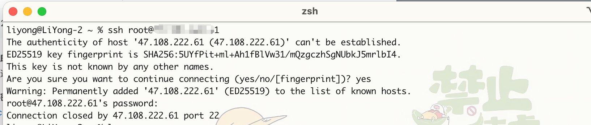
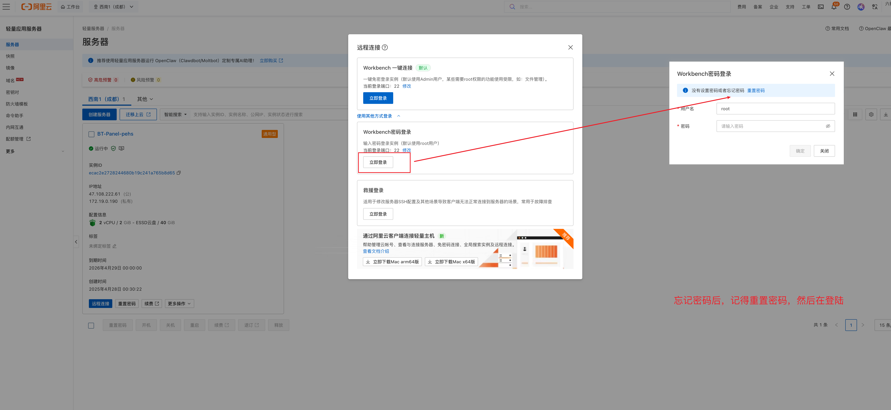
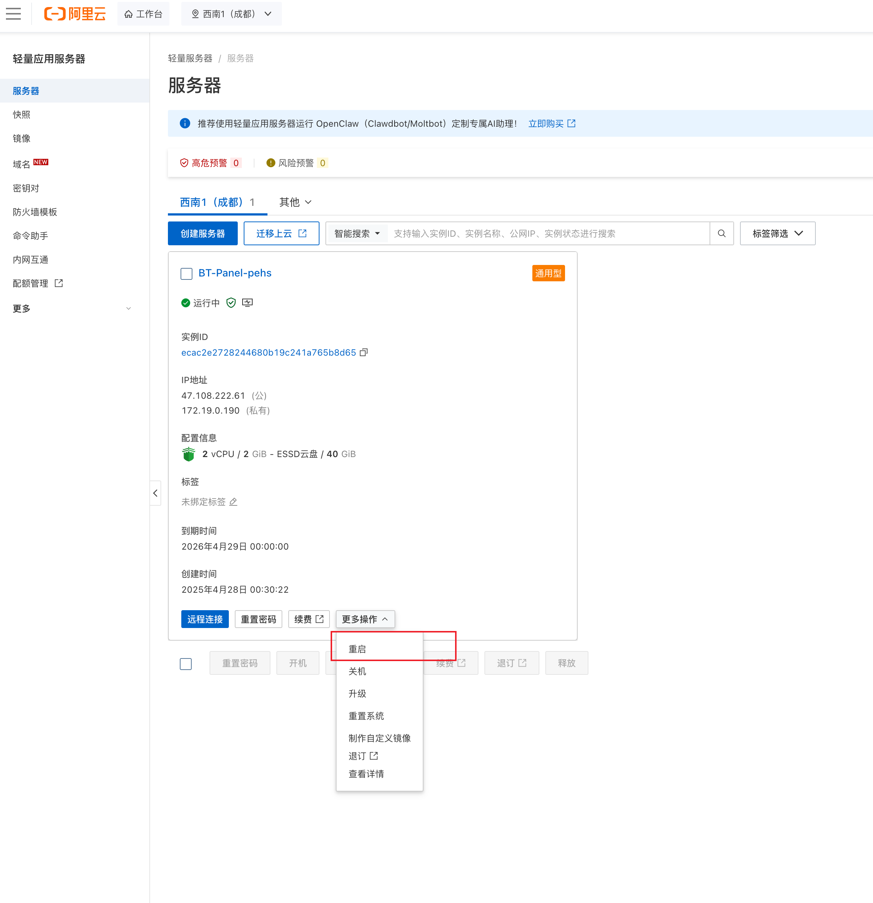
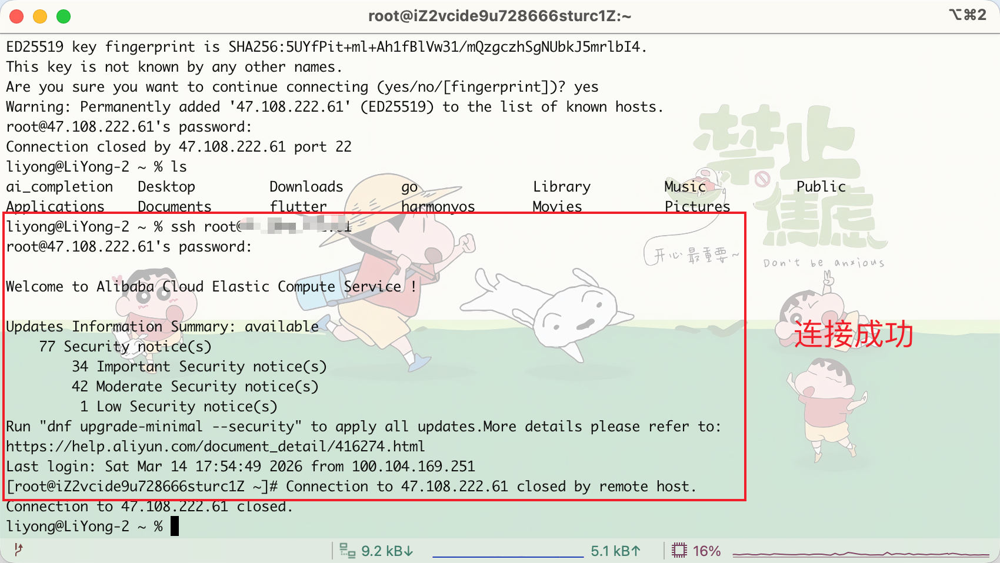
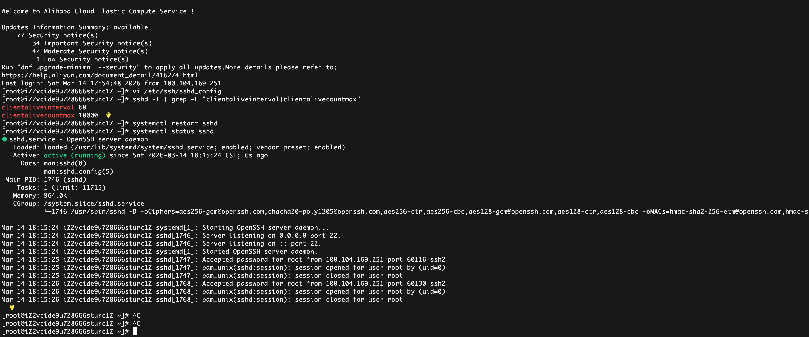

# 服务器的基本使用

## 1、mac 连接阿里云服务器

### 1）连接

```bash
liyong@LiYong-2 ~ % ssh root@xx.xx.xx.xx
# 服务器对公ip
```

首次连接：输入 `yes` 并回车，确认信任服务器



出现上面的错误，需要秋改密码



修完完密码后，重启服务





### 2）增加连接时间



```bash
# 1. 编辑 SSH 配置文件
vi /etc/ssh/sshd_config

# 2. 找到以下配置项，修改/添加（没有就新增）：
ClientAliveInterval 60    # 每60秒向客户端发送一次心跳
ClientAliveCountMax 10000    # 心跳失败10000次后才断开（约6.94天）
# 注释掉或删除：# TimeoutIdle 0（如果有）

# 推荐
# ClientAliveInterval 60      # 每60秒发1次心跳（检测更及时）
# ClientAliveCountMax 120     # 累计120次失败 → 60×120=7200秒=2小时

# 3. 保存退出 vi（按 Esc → 输入 :wq → 回车）

# 4. 重启 SSH 服务使配置生效
systemctl restart sshd
```

### 3）推出

```bash
exit  # 最常用、最通用的退出命令
# 或
logout  # 效果和exit完全一致
```

执行后终端会显示：

```tex
logout
Connection to 47.108.222.61 closed.
```
